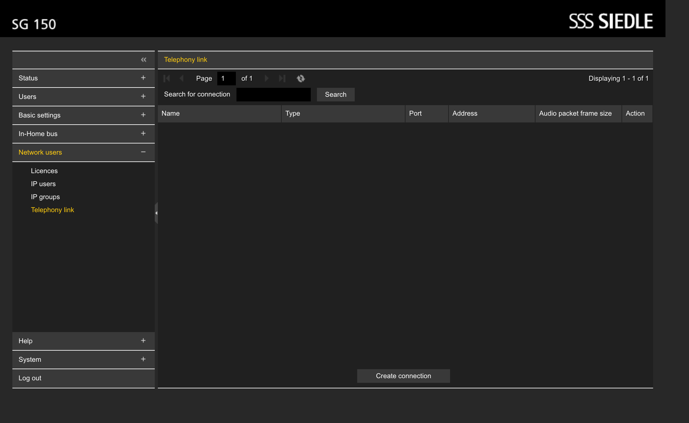
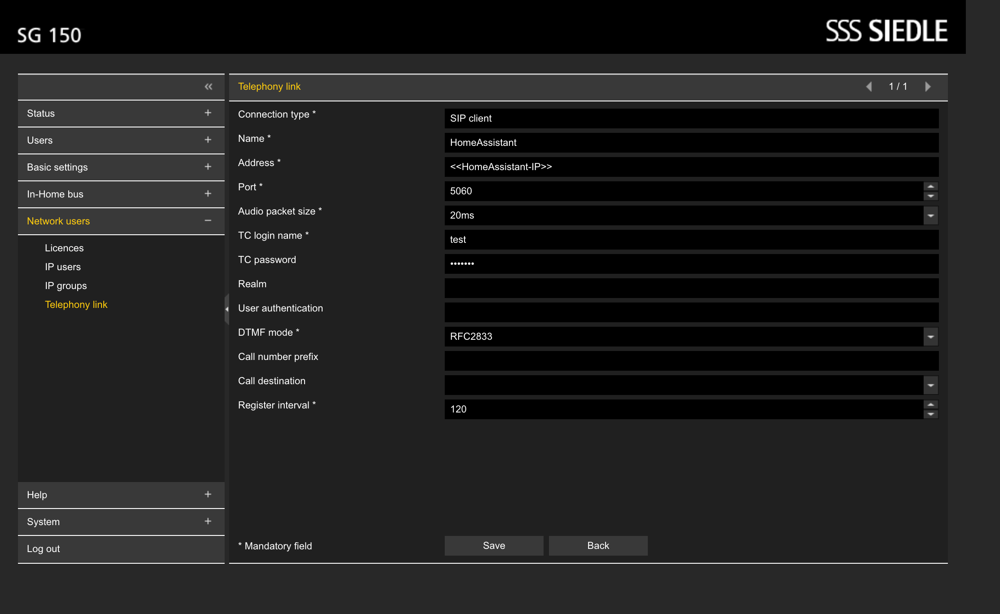
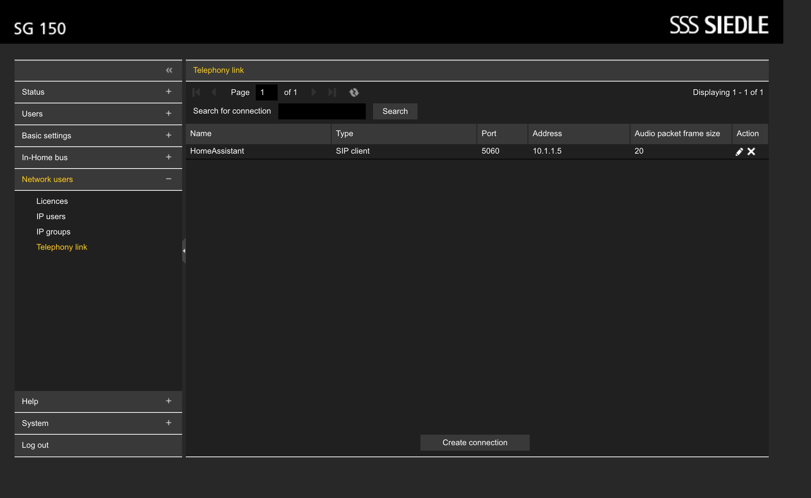
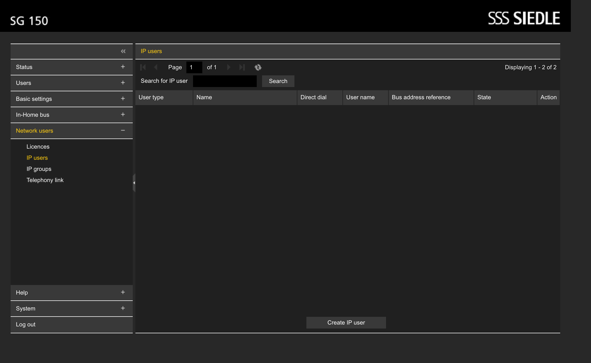
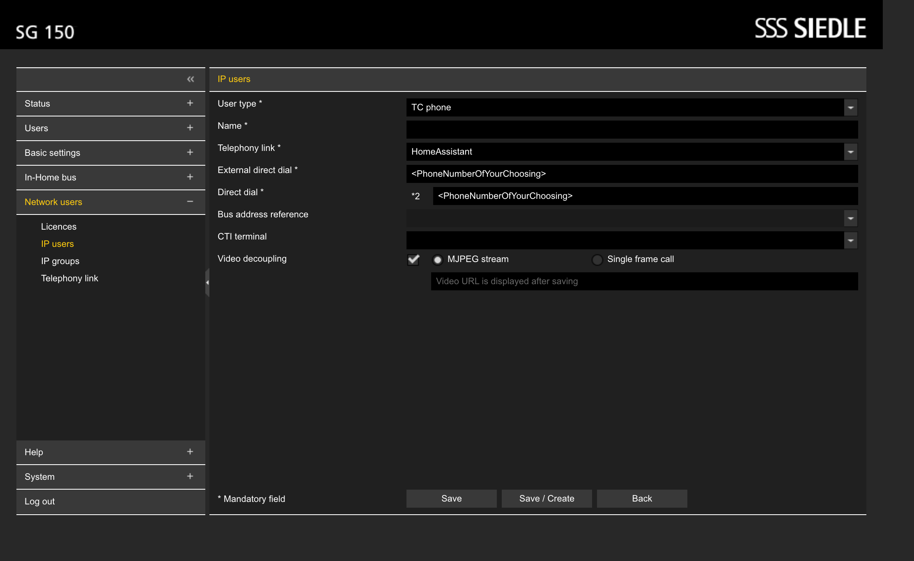

# Siedle Gateway 150 Integration

This Home Assistant custom integration allowing integration with Siedle Gateway 150 (SG-150) via a local connection. It is developed to integrate a Siedle Door Camera with Home Assistant.

This integration will run a minimal SIP Server that can be configured in the SG-150 as a telephone device.

Currently the integration exposes:

- Gateway Information (Mac Adresse, SIP Connection Status)
- All phone devices know to the SG-150
  - Phone number sensor
- All video extractors
  - Camera for the live stream
- Services:
  - start_call: Start a phone call within the In-Home system
  - stop_call: Stop a phone call within the In-Home system

# Disclaimer

⚠️ This custom component is an independent project and is not affiliated with Siedle. It has been developed for my own needs. Any trademarks or product names mentioned are the property of their respective owners. ⚠️

# Configuration

> This configuration will require a license for the SG-150 that includes the "Telephony" feature.
> You can check this by logging into your SG-150 and navigating to `Network users -> License`.  
> Check the "Telephony" row to see if you have at least one license remaining.

To get the most of this integration you need to configure the SG-150 to connect to the SIP-Server provided by this extension.

While setting up the integration within Home Assistant you will be asked to provide the following information to connect to your SG-150:

- Host Address (IP Address of the SG-150)
- Username (in most cases `admin`)
- Password (the one used for the web interface)

In addition to that the Home Assistant instance will also configure a SIP-Server, please make sure to setup the following values:

- SIP Caller IP: `<HomeAssistant-IP>`
- SIP Username: `<NameOfYourChoosing>`
- SIP Password: `<PasswordOfYourChoosing>`
- SIP Number: `<PhoneNumberOfYourChoosing>`
- SIP Port: `<PortOfYourChoosing>` (default: 5060)

These values will be used to configure the SG-150 to connect to the SIP-Server provided by this integration.

## Configure the SG-150 to connect to the SIP-Gateway

1. Login to your SG-150 and navigate to Network users -> Telephony link.  
   
1. Click on "Create connection"  
   
1. Fill in the following values:
   | Field | Value |
   |---------------------|----------------------|
   | Connection Type | SIP client |
   | Connection Name | HomeAssistant |
   | Address | `<HomeAssistant-IP>` |
   | Port | `<PortOfYourChoosing>` |
   | TC login name | `<NameOfYourChoosing>` |
   | TC Password | `<PasswordOfYourChoosing>` |
   > Everything else can stay default.
1. Click on "Save" -> You should now see "Changes have been implemented. Connection status: successfully registered."
1. When going back to the overview you should see the new connection listed
   

> In HomeAssistant the entity `binary_sensor.sgs_homeassistant_sip_connection` will indicate the connection status and should be "On" now.

## Create a TC phone connected to the SIP-Gateway

1. Login to your SG-150 and navigate to Network users -> IP users.  
   
1. Click on "Create IP user"  
   
1. Fill in the following values:
   | Field | Value |
   |---------------------|----------------------|
   | User Type | TC phone |
   | Name | `<SomeConnectionName>` (not important) |
   | Telephony link | HomeAssistant |
   | External Direct Call | `<PhoneNumberOfYourChoosing>` (same as integration configuration) |
   | Direct Call | `<PhoneNumberOfYourChoosing>` |
   | Video decoupling | `MJPEG stream` |
   > Everything else can stay default.
1. Click on "Save/Create"

> In HomeAssistant you should now see a new camera entity representing the video stream of this TC phone. You might need to reload the integration to see the new entity.
